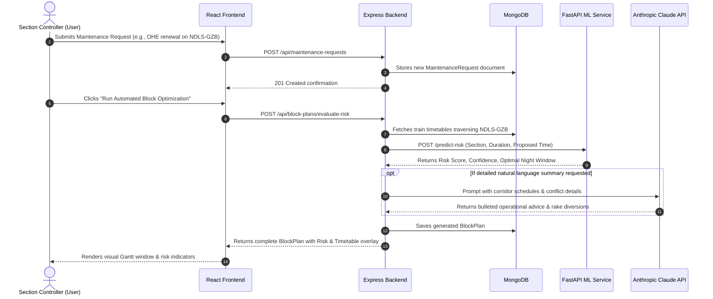

# 🏗️ System Architecture & Communication Flow (`architecture.md`)

This document describes the high-level architecture of the **SIH Indian Railways Maintenance Block Planning & Optimization System**, detailing how the frontend, backend, ML service, database, and external LLM APIs communicate over HTTP.

---

## 🌐 1. High-Level Architecture Diagram

```mermaid
graph TD
    User["Railway Section Controller / Planner"] -->|HTTPS / Browsers| Frontend["Frontend UI<br/>(React 18 + Vite)<br/>Port: 5173 / Vercel"]
    
    subgraph "Local / Cloud Monorepo Cluster"
        Frontend -->|REST API JSON / HTTP| Backend["Backend Core API<br/>(Node.js + Express)<br/>Port: 5000 / Render"]
        
        Backend -->|Mongoose ODM / TCP 27017| DB[("Database<br/>(MongoDB / Atlas)<br/>Collections: Sections, Trains, Blocks")]
        
        Backend -->|HTTP POST / JSON (Internal)| ML["ML Service<br/>(Python FastAPI)<br/>Port: 8000 / Render"]
    end
    
    Backend -->|HTTPS API / JSON| Anthropic["Anthropic Claude API<br/>(claude-3-5-sonnet)<br/>AI Reasoning & Conflict Summaries"]
```

---

## 🔄 2. End-to-End Operational Flow



---

## 🔌 3. Inter-Service Communication Details

### A. Frontend ↔ Backend
- **Protocol**: HTTP/1.1 (or HTTP/2 in production) over RESTful JSON.
- **Port in Development**: Frontend runs on `5173`, Backend runs on `5000`.
- **CORS & Proxying**:
  - `cors` middleware is active in `backend/src/server.js`.
  - Vite is preconfigured in `frontend/vite.config.js` with a proxy routing `/api/*` to `http://localhost:5000`.

### B. Backend ↔ ML Service
- **Protocol**: Synchronous HTTP/REST using `axios` in `backend/src/services/ml.service.js`.
- **Port in Development**: ML Service listens on `8000`.
- **Resilience**: The backend includes timeout guards (4000ms) and fallback heuristics in case the ML service is temporarily down during local hackathon demos.

### C. Backend ↔ MongoDB
- **Protocol**: MongoDB Wire Protocol via **Mongoose v8**.
- **Port**: Default `27017` or standard SRV string for MongoDB Atlas.
- **Connection Strategy**: Uses `serverSelectionTimeoutMS: 5000` to allow offline booting of the Express server for standalone UI development.

### D. Backend ↔ Anthropic Claude
- **Protocol**: Secure HTTPS via `@anthropic-ai/sdk`.
- **Model**: `claude-3-5-sonnet-20241022` or `claude-3-haiku-20240307`.
- **Usage**: Used to synthesize human-readable conflict mitigation briefs for division operating officers.
